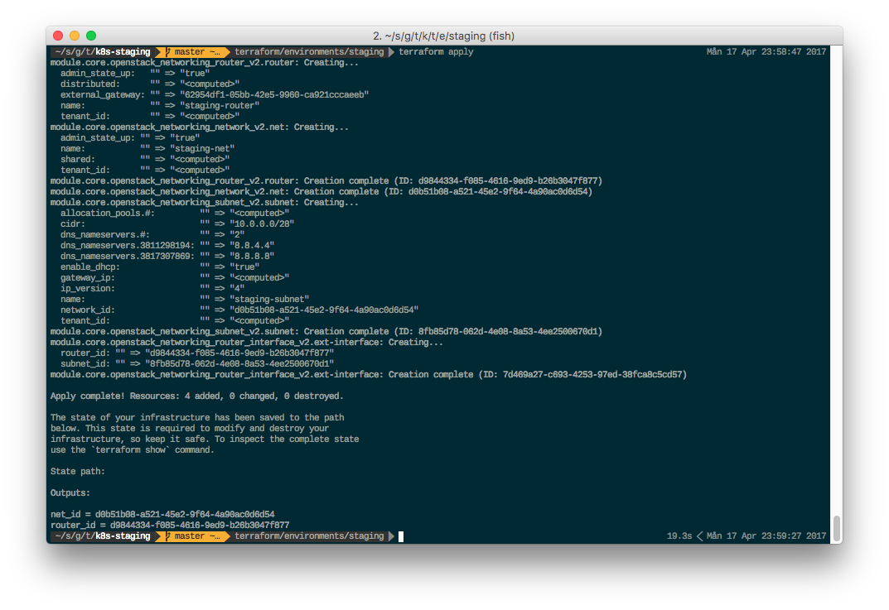
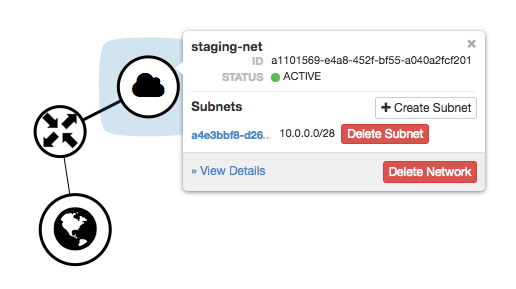

# Core Network

This Terraform module simplifies creation of core network in your terraform tenant.

Every core network you create will be on it's own "tree" from the external gateway.

## Usage

This assumes you've already setup an OpenStack provider with correct credentials and auth endpoint.

```bash
module "core" {
  source = "git@github.com:tjakobsson/openstack-terraform-modules.git//modules/core-net"
  prefix_env = "staging"
  ip_cidr = "10.0.0.0/28"
  dns = ["8.8.8.8", "8.8.4.4"]                 # default value, optional
  gw = "62954df1-05bb-42e5-9960-ca921cccaeeb"  # default value, optional
}

output "net_id" {
  value = "${module.core.net_id}"
}

output "router_id" {
  value = "${module.core.router_id}"
}
```

### Output



